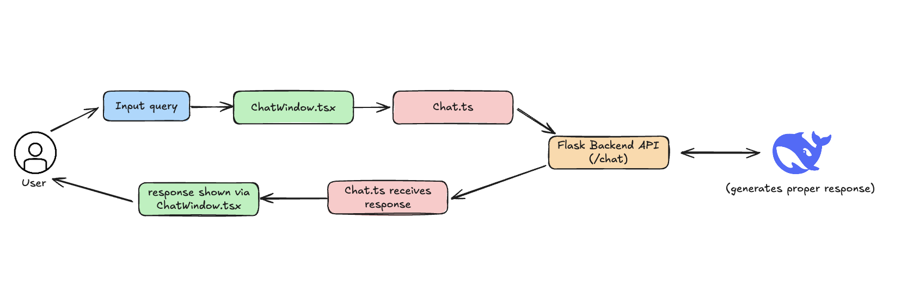
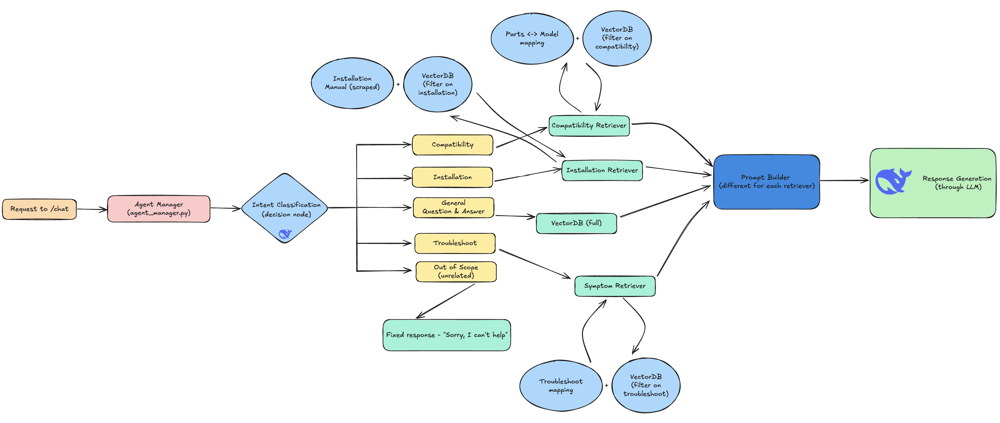

# PartSelect.com QA Assistant

An AI-powered question-answering agent designed to help users find appliance parts and repair information on [partselect.com](https://www.partselect.com), specifically the dishwasher and refridgerator sections.

The agent is hosted here: .


## Demo! (Loom)


## Features

### Intent Classification
- Detects whether a query is in-scope (about refrigerator/dishwasher parts) or out-of-scope (like general math or unrelated questions).
- Out-of-scope queries are gracefully handled with a fallback response.

### Product Information Retrieval (RAG)
- Integrates a retrieval-augmented generation (RAG) pipeline using a vector database.
- Retrieves relevant product details (e.g., compatibility, installation guides, troubleshooting steps).
- Optimized retrieval with embeddings ensures accurate and context-aware responses.

### Agentic Flows by Query Type
- Compatibility → Runs a compatibility RAG flow to check if parts work with given models.
- Installation → Calls an installation scraper or retrieval pipeline for step-by-step guides.
- Troubleshooting → Calls a troubleshooting flow to suggest solutions based on common issues.
- Out of Scope → Routes irrelevant questions to an “out of scope” handler.

### Frontend (Next.js + Tailwind CSS)
- Simple chat UI aligned with PartSelect branding and color schemas.
- Responsive design, works across desktop and mobile.

### Backend
- Python backend with FastAPI to handle requests
- API Documentation and testing (swagger) provided out of the box (`localhost:8000/docs`)
- Integration with Deepseek language model for generation.
- Vector database (e.g., FAISS / Chroma / Pinecone) for retrieval.
- Modular architecture for easy extension (new flows, more product types).

### Error & Edge-Case Handling
- Gracefully responds when no relevant product data is found.
- Prevents hallucinations by grounding answers in retrieved docs.
- Out-of-scope guardrails to keep responses on track.


## Technical Architecture

### User flow on the frontend 

<div align="center">
  
</div>

### Backend response generation flow
<div align="center">
  
</div>

## Project Structure

```
PartSelect-Assistant/
├── README.md                           # Main project documentation
├── .gitignore                          # Git ignore patterns
│
├── docs/                              # Documentation and assets
│   └── images/
│       ├── backend-architecture.png   # Backend flow diagram
│       └── frontend-user-flow.png     # Frontend user flow diagram
│
├── backend/                           # Python backend (FastAPI)
│   ├── .env.example                   # Environment variables template
│   ├── requirements.txt               # Python dependencies
│   ├── app.py                         # Main FastAPI application
│   ├── config.py                      # Configuration management
│   ├── agent_manager.py               # Core agent orchestration
│   ├── vector_manager.py              # Vector database operations
│   │
│   ├── retrievers/                    # RAG retrieval modules
│   │   ├── __init__.py
│   │   ├── compatibility_retriever.py # Part compatibility logic
│   │   ├── part_retriever.py          # Product information retrieval
│   │   └── symptom_retriever.py       # Troubleshooting retrieval
│   │
│   ├── services/                      # External API integrations
│   │   ├── deepseek_client.py         # DeepSeek API client
│   │   ├── openai_client.py           # OpenAI API client
│   │   └── google_search.py           # Web search integration
│   │
│   ├── utils/                         # Utility functions
│   │   ├── chunking.py                # Text processing utilities
│   │   └── logging_utils.py           # Logging configuration
│   │
│   └── tests/                         # Unit tests
│       ├── test_agent_intent.py       # Intent classification tests
│       └── test_vector.py             # Vector operations tests
│
└── frontend/                          # Next.js frontend
    ├── .env.local.example             # Frontend environment template
    ├── package.json                   # Node.js dependencies
    ├── next.config.ts                 # Next.js configuration
    ├── tsconfig.json                  # TypeScript configuration
    ├── tailwind.config.ts             # Tailwind CSS configuration
    ├── vercel.json                    # Vercel deployment config
    │
    ├── public/                        # Static assets
    │   ├── file.svg
    │   ├── globe.svg
    │   ├── next.svg
    │   ├── vercel.svg
    │   └── window.svg
    │
    └── src/
        └── app/                       # Next.js App Router
            ├── layout.tsx             # Root layout component
            ├── page.tsx               # Main chat interface
            ├── globals.css            # Global styles
            ├── favicon.ico            # Site icon
            └── how-it-works/          # How it works page
                └── page.tsx
```

The core parts are: 
- `/frontend`: Next.js project with...
- `/backend`: A python backend with FastAPI that hosts our APIs
- `/docs`: Docs and images about the project architecture 

## Getting Started

### Prerequisites

Before running this project, make sure you have the following installed:

**For Backend:**
- Python 3.8+ 
- pip (Python package manager)

**For Frontend:**
- Node.js 18+ 
- npm

**API Keys (Required):**
- DeepSeek API key (for language model generation)
- OpenAI API key (optional, for embeddings/alternative models)


### Installation

There's a couple ways that we can get up and running: the native method or via docker.

#### Native

**1. Clone the Repository**
```bash
git clone https://github.com/akhilvreddy/PartSelect-Assistant
cd PartSelect-Assistant
```

**2. Backend Setup**
```bash
cd backend

# Create virtual env
python3 -m venv .venv

# Install Python dependencies
pip install -r requirements.txt

# Set up environment variables
cp .env.example .env
# Edit .env with your actual API keys and configuration
```

After this step, direct back to the root of the repository.

**3. Frontend Setup**
```bash
cd frontend

# Install Node.js dependencies
npm install

```

Again, please direct back to the root of the repository.

**4. Run the Application**
```bash
# Terminal 1: Start the backend
cd backend
python app.py

# Terminal 2: Start the frontend
cd frontend
npm run dev
```

The application will be available at:
- Frontend: http://localhost:3000
- Backend API: http://localhost:5000
- API Documentation: http://localhost:5000/docs

#### Docker

Docker simplifies things a lot via the `docker-compose.yaml` file that I wrote. 


## Development Process

When starting this project, I first started out by listing the requirements of what the agent had to do and was able to narrow it to the 5 specific flows (as shown in the diagram above). After that, I quickly sketched out the APIs that the backend would have to provide for the frontend to work nicely. After getting those setup, I grabbed the hex codes of the two main colors of [PartSelect](https://partselect.com) and fed that into Cursor and let it help me create the frontend. I made a couple more user experience updates on the frontend (like giving the user ability to select the model version) and updated the APIs to reflect those changes.

## Evaluation Metrics

keep for later for now


## Future Enhancements  

If this were to go into production, there are several key improvements I would prioritize to make the agent more robust, scalable, and user-friendly:  

1. **Authentication & User Accounts**  
   - Add login support and user profiles so customers can save queries, track past troubleshooting steps, and receive personalized recommendations.  

2. **Enhanced Data Retrieval**  
   - Move from lightweight scraping to a crawled and indexed knowledge base refreshed occassionally.  

3. **Multi-Modal Support**  
   - Allow users to upload images of appliance model labels or parts.  
   - Use vision models to auto-detect model numbers and recommend relevant parts.  

4. **Monitoring & Observability**  
   - Add metrics on latency, error rates, and intent classification accuracy.  
   - Centralize logs with something like ELK or OpenTelemetry for debugging.  

## Infrastructure

To host `/frontend` I used Vercel since this was a Next.js application. I was able to host `/backend` on Render by conneting the repository and giving it the build commands which made the deployment process super simple.


---

*Instalily Case Study 09/2025.*