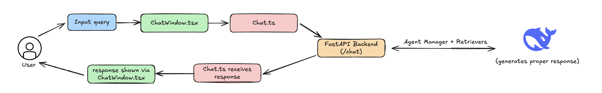

# PartSelect.com Q&A Assistant

An AI-powered question-answering agent designed to help users find appliance parts and repair information on [partselect.com](https://www.partselect.com), specifically the dishwasher and refrigerator sections.


## Demo

The demo is [here](https://www.loom.com/share/ff4e094c9dd446ceb79f9ca594d1e617?sid=d4ada82a-edb7-455f-9016-96dcfab39593)!

## Examples

1) Out of Scope

<div align="center">
  
</div>

2) Compatibility

<div align="center">
  
</div>

3) Installation

<div align="center">
  
</div>

4) Troubleshoot

<div align="center">
  
</div>

5) General QnA

<div align="center">
  
</div>

The main thing I was struggling with is formatting the responses in a proper way. The text is being turned in markdown format but outputted as a plain text file which I am working on fixes on the frontend.

## Features

### Intent Classification
- Detects whether a query is in-scope (about refrigerator/dishwasher parts) or out-of-scope (like general math or unrelated questions).
- Out-of-scope queries are gracefully handled with a fallback response.

### Product Information Retrieval (RAG)
- Integrates a retrieval-augmented generation (RAG) pipeline using a vector database.
- Retrieves relevant product details
- Optimized retrieval with embeddings ensures accurate and context-aware responses.

### Agentic Flows by Query Type
- General QnA → Searches the entire vector database to check for similarity and responds.
- Compatibility → Runs a compatibility RAG flow to check if parts work with given models.
- Installation → Calls a retrieval pipeline for step-by-step guides.
- Troubleshooting → Calls a troubleshooting flow to suggest solutions based on common issues.
- Out of Scope → Routes irrelevant questions to an “out of scope” handler.

### Frontend (Next.js + Tailwind CSS)
- Simple chat UI aligned with PartSelect branding and color schemas.
- Responsive design, works across desktop and mobile.

### Backend
- Python backend with FastAPI to handle requests
- API Documentation and testing (swagger) provided out of the box (`localhost:8000/docs`)
- Integration with Deepseek language model for intent detection and text generation.
- Vector database (Chroma on local) for retrieval.
- Modular architecture for easy extension (new flows, more product types).

### Error & Edge-Case Handling
- Gracefully responds when no relevant product data is found.
- Prevents hallucinations by grounding answers in retrieved docs.
- Out-of-scope guardrails to keep responses on track.

## Tech Stack
- Frontend: Next.js 15, React 19, Tailwind CSS
- Backend: FastAPI, Python 3.8+
- AI: DeepSeek (Chat), OpenAI Embeddings
- Database: ChromaDB Local Storage
- Deployment: Local Development

---

## Technical Architecture

### User flow on the frontend 

<div align="center">
  
</div>

The user starts by entering a query, which makes its way from the React input box all the way to the `/chat` API endpoint and back in the same way. I originally had a `chat.ts` file but ended up removing it since I could make the API call right from `page.tsx`.

### Backend response generation flow
<div align="center">
  
</div>

As soon as a request hits the `/chat` API, the first thing that the agent manager does is identify the intent. This is done by an internal call to DeepSeek's API where it classifies the query as one of the 5 shown above. If the query's intent is out of scope, a pre-made response saying that it can't help is quickly sent back to the user. If the query does fall under one of the 4 pre-scoped ones that we have, we call a retriever (which hits a local VectorDB + optionally a object map) to get the specific information that the query was asking for. Finally, we send the information to a prompt builder (which is made specifically for each intent) and the whole thing is sent to the LLM to generate a coherent response.

### Retriever Deep Dive

Each intent type triggers a specialized retriever that uses different data sources and processing logic:

**Compatibility Retriever**
- **Data Sources:** Parts ↔ Model mapping + VectorDB (filtered on compatibility)
- **Process:** Takes a part number and model, checks both structured mapping data and semantic similarity in the vector database
- **Output:** Compatibility status with specific model information

**Installation Retriever** 
- **Data Sources:** Installation Manual (scraped) + VectorDB (filtered on installation)
- **Process:** Searches through step-by-step installation guides using semantic similarity
- **Output:** Detailed installation instructions specific to the part/appliance

**General Q&A Retriever**
- **Data Sources:** VectorDB (full database search)
- **Process:** Performs broad semantic search across all available product information
- **Output:** Relevant product details, specifications, or general information

**Troubleshoot Retriever**
- **Data Sources:** Troubleshoot mapping + VectorDB (filtered on troubleshoot)
- **Process:** Matches symptoms to known issues using both structured troubleshooting data and semantic search
- **Output:** Diagnostic steps and potential solutions

**Out of Scope Handler**
- **Process:** Returns a pre-defined response without hitting any database
- **Output:** Polite message explaining the system's scope limitations

## Project Structure

```
PartSelect-Assistant/
├── README.md                         # Main project documentation
├── docs/                             # Documentation and assets
│   └── images/
│
├── backend/                          # Python backend (FastAPI)
│   ├── app.py                        # Main FastAPI application
│   ├── agent_manager.py              # Core agent orchestration
│   ├── services/                     # External API integrations & retrievers
│   ├── utils/                        # Utility functions
│   └── tests/                        # Unit tests
│
└── frontend/                         # Next.js frontend
    ├── package.json                  # Node.js dependencies
    ├── next.config.ts                # Next.js configuration
    └── src/app/                      # Next.js App Router
        ├── layout.tsx                # Root layout component
        ├── page.tsx                  # Main chat interface
        ├── test-api/                 # API testing page
        ├── globals.css               # Global styles
        └── favicon.ico               # Site icon
```
---

## Getting Started

### Prerequisites

Before running this project, make sure you have the following installed:

**For Backend:**
- Python 3.8+ 
- pip (Python package manager)

**For Frontend:**
- Node.js 18+ 
- npm

**API Keys (Required):**
- DeepSeek API key (for language model generation)
- OpenAI API key (optional, for embeddings/alternative models)

---

### Installation

To get up and running we need to launch the frontend (which is a Next.js application) and the backend (Python + FastAPI).

**Clone the Repository**
```bash
git clone https://github.com/akhilvreddy/PartSelect-Assistant
cd PartSelect-Assistant
```

**Frontend Setup**

First direct into the `/frontend` folder.

```bash
cd frontend
```

Install node dependencies.
```bash
npm install
```

To run the application in dev (which is what I did):

```bash
npm run dev
```

For production (not needed right now):
```bash
npm start
```

**Backend Setup**

Now direct into the `/backend` folder.

```bash
cd backend
```

Create a virtual environment.

```bash
python3 -m venv .venv
```
Install Python dependencies

```bash
pip install -r requirements.txt
```
Set up environment variables by editing .env with your actual API keys and configuration.

```bash
cp .env.example .env
```

Start the API

```bash
python app.py
```

The application will be available at:
- Frontend: http://localhost:3000
- Backend API: http://localhost:8000
- API Documentation (Swagger): http://localhost:8000/docs

---

## API

This is what the API interface looks like

<div align="center">
  
</div>

### POST /chat
Main endpoint for user queries. Accepts a POST request with the user's question and returns an AI-generated response using RAG pipeline and intent classification.

### GET /health
Simple health check endpoint that returns the API status. Used for monitoring and testing if the backend service is running properly.

### POST /intents
This is an internal API used to identify the user's intent once a query comes into `/chat`.


## Development Process

When starting this project, I first started out by listing the requirements of what the agent had to do and was able to narrow it to the 5 specific flows (as shown in the diagram above). After that, I quickly sketched out the APIs that the backend would have to provide for the frontend to work nicely. After getting those setup, I grabbed the hex codes of the two main colors of [PartSelect](https://partselect.com) and based the schema of this application based on that color palette.


## Future Enhancements

If this were to go into production, there are several key improvements I would prioritize to make the agent more robust, scalable, and user-friendly:  

1. **Authentication & User Accounts**  
   - Add login support and user profiles so customers can save queries, track past troubleshooting steps, and receive personalized recommendations.  

2. **Enhanced Data Retrieval**  
   - Move from lightweight scraping to a crawled and indexed knowledge base refreshed occasionally that sits on a CICD pipeline.  

3. **Multi-Modal Support**  
   - Allow users to upload images of appliance model labels or parts.  
   - Use vision models to auto-detect model numbers and recommend relevant parts.  

4. **Monitoring & Observability**  
   - Add metrics on latency, error rates, and intent classification accuracy.  
   - Centralize logs with something like ELK or OpenTelemetry for debugging.  

5. **Infrastructure**
   - Since this is a Next.js application, it would make a lot of sense to host the frontend on Vercel.
   - The backend could be hosted on any cloud provider as a container or via Render by giving it the build commands for `/backend`.


---
